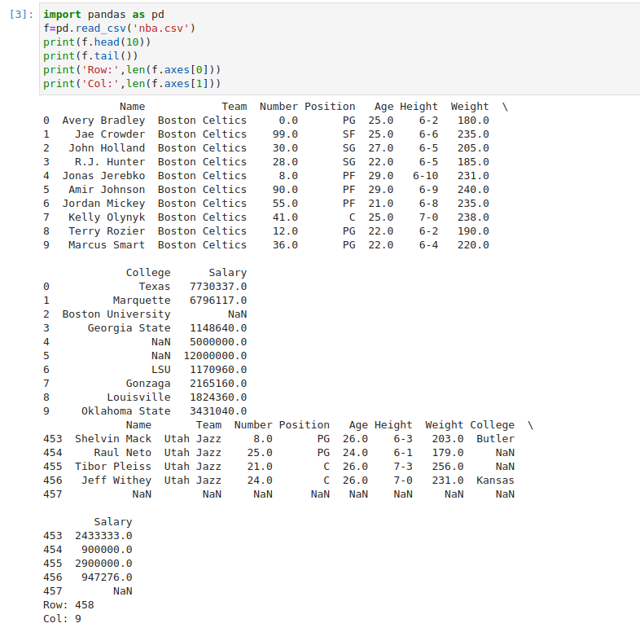

# Read-from-CSV

## AIM:
To write a python program for reading content from a CSV file.

## ALGORITHM:
### Step 1: Import pandas as pd.
### Step 2: Read the CSV file using read_csv method.
### Step 3: Use head and tail method to get the required contents from the file.
### Step 4: Use len() method to get the number of rows and columns.
### Step 5: Print the output.

## PROGRAM:

Developed by : SRINITHI V

Register Number : 22006082

```py
import pandas as pd
f=pd.read_csv('nba.csv')
print(f.head(10))
print(f.tail())
print('Row:',len(f.axes[0]))
print('Col:',len(f.axes[1]))
```

## OUTPUT:



## RESULT:

Thus a python program is written to read the contents of a CSV file.